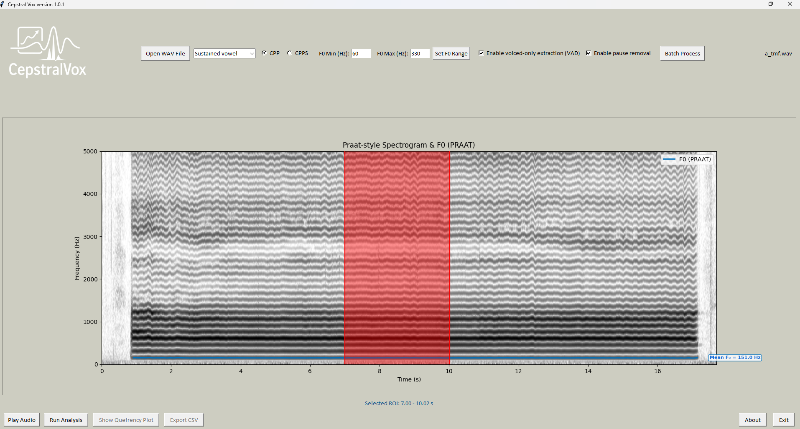

# CepstralVox

**CepstralVox** is a free, open-source, cross-platform tool for cepstral and voice analysis.

CepstralVox provides user-friendly batch and interactive analysis of CPP and CPPS directly from WAV files, replicating Praat’s acoustic algorithms. Designed for both research and clinical settings.

---

## Features

- **Accurate extraction of CPP and CPPS** (Cepstral Peak Prominence, Praat-style)
- **Visual, interactive spectrogram** with F0 (Praat pitch curve)
- **Automatic batch processing** of multiple audio files
- **Region of interest (ROI) selection** for focused analysis
- **Praat-compatible:** Uses Praat’s algorithms for maximal reproducibility
- **Export of results** to CSV for statistical analysis
- **Clean, intuitive GUI** (Tkinter + Matplotlib)
- **Free for research and clinical use**

---

## Installation

**Requirements**
- Python 3.8+
- [Praat](https://www.fon.hum.uva.nl/praat/) (add `praat.exe` or `praat` to your system PATH)
- Recommended: [Anaconda](https://www.anaconda.com/products/distribution)

**Python dependencies:**
```bash
pip install numpy matplotlib soundfile parselmouth pillow
```

**Download:**
```bash
git clone https://github.com/tiagolbc/cepstralvox.git
cd cepstralvox
```

---

## Usage

**Launching the GUI**
```bash
python main.py
```

### Main Features

- **Open WAV File:** Select an audio file for analysis
- **Select Analysis Type:** CPP or CPPS, and file type (sustained vowel or connected speech)
- **ROI Selection:** Click and drag on the spectrogram to select region
- **Run Analysis:** Calculate and display results
- **Show Quefrency Plot:** Visualize the quefrency spectrum
- **Batch Process:** Analyze multiple files at once
- **Export CSV:** Save your results

### Batch Mode

- Use the **Batch Process** button to analyze all WAV files in a folder.
- Results and quefrency plots are saved automatically.

---

## Screenshot



---

## How to Cite

If you use **CepstralVox** in scientific publications, please cite:

> Cruz, Tiago Lima Bicalho. *CepstralVox: A tool for cepstral and voice analysis*. Zenodo. https://doi.org/10.5281/zenodo.9999999

---

## Support and Contact

- Instagram: [@fonotechacademy](https://instagram.com/fonotechacademy)
- Email: fonotechacademy@gmail.com
- Website: https://www.fonotechacademy.com/en

For feature requests or bug reports, please open an issue on GitHub.

---

## License

This project is licensed under the MIT License.

---
